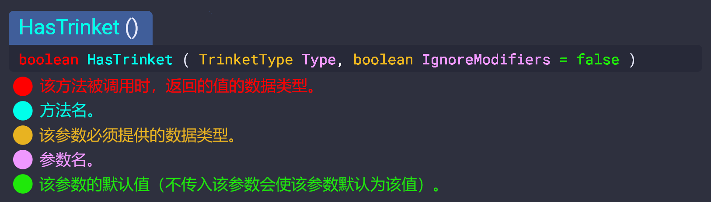

---
search:
  boost: -999
---
# 以撒的结合：忏悔Lua API文档
___

本文档是一个社区策划的项目，为《以撒的结合：忏悔》Lua Mod API提供的功能提供了附加信息和代码示例。

该项目源于wofsauge的英文文档 **[:fontawesome-brands-github: Github Project](https://github.com/wofsauge/IsaacDocs)**

如果你想帮忙协助该项目，考虑访问 **[:fontawesome-brands-github: Github Project](https://github.com/58115310/IsaacDocs)**

如果你对制作MOD有任何疑问，请访问官方Discord：

**[:fontawesome-brands-discord: 官方以撒Discord服务器](https://discord.gg/isaac)**或者**[:fontawesome-brands-discord: 官方以撒MOD制作Discord服务器](https://discord.gg/KbevtvgD4z)**

### 如何阅读文档
查看[常见问题解答](./faq/FaqHome.md)来寻找答案。

下图提供了如何阅读文档的快速示例：

